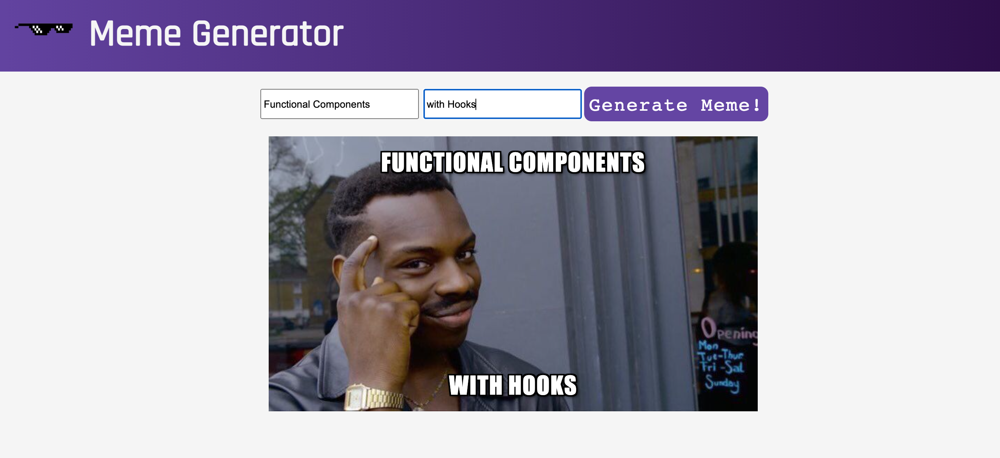

# Quote Generator

> A website on which you generate meme's by adding text on random meme images.
>
> 👉 [Live demo link to be added]()



## Why I've build this?

Created this Web App following the [React Basic course on Scrimba](https://scrimba.com/learn/learnreact).

In the course the tutor used `Class Components` which I've changed to `Functional Components` and to make the api work I've used the Hook `useEffect` with the `second argument an empty array (dependencies)`. The reason why is cause I wanted the effect to run only once (similar to componentDidMount).

Besides this I got to practice CSS. Got a better understanding of how absolute and relative positioning works as well as why this “left: 50%, transform: translateX(-50%)” horizontally center an element. More on this [here](https://twitter.com/Stefania_Rosca/status/1337155565433315329)

## Technologies

This app was build with:

- [React](https://reactjs.org/docs/create-a-new-react-app.html) with `useState` and `useEffect` Hook
- [External Meme Generator API](https://api.imgflip.com/get_memes)

## Install and Play

```
git clone https://github.com/stefi23/meme-generator.git
$ cd meme-generator
$ npm install
$ npm start
```
